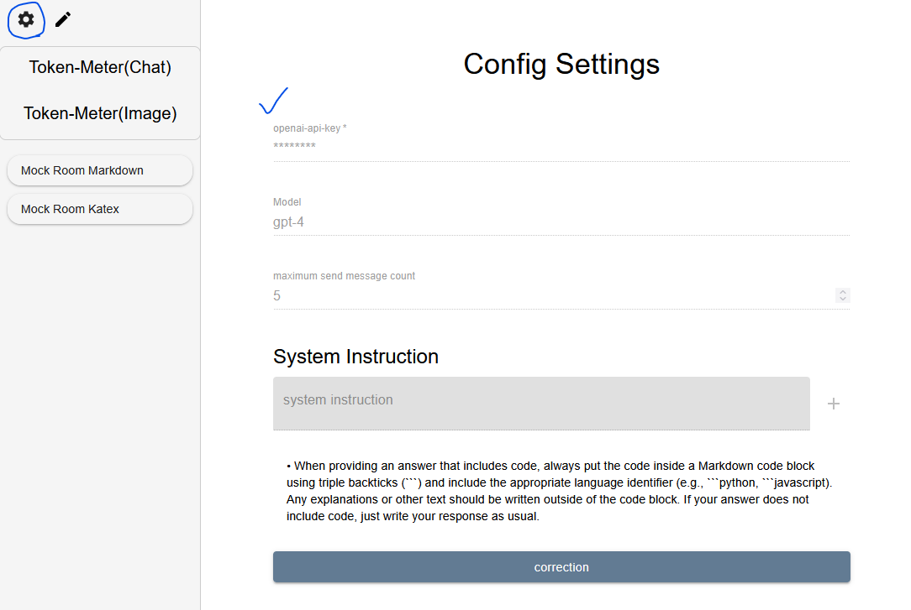
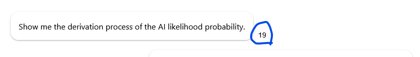
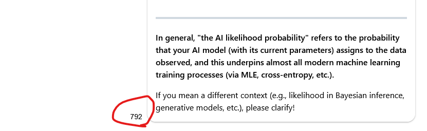
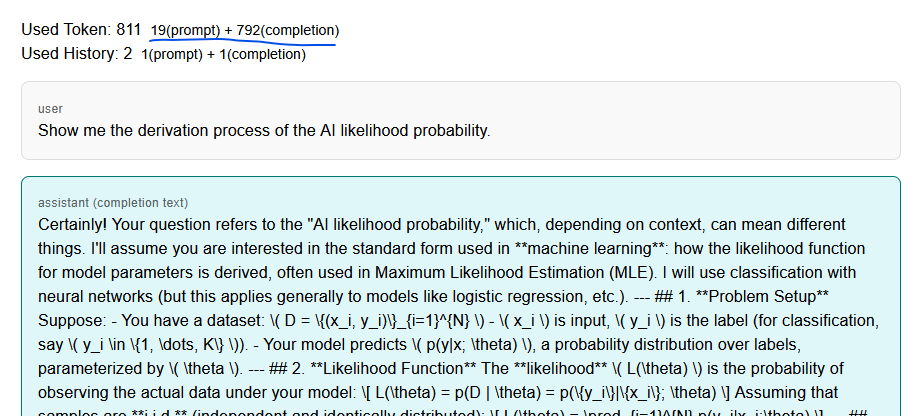
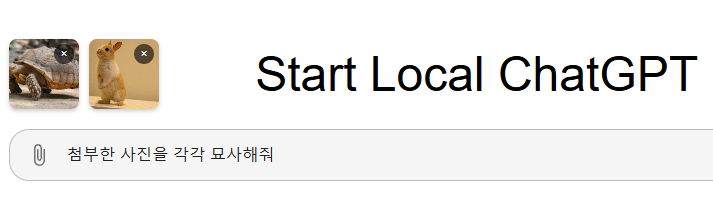
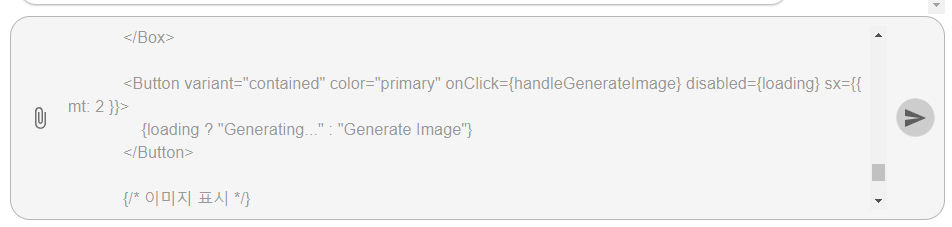
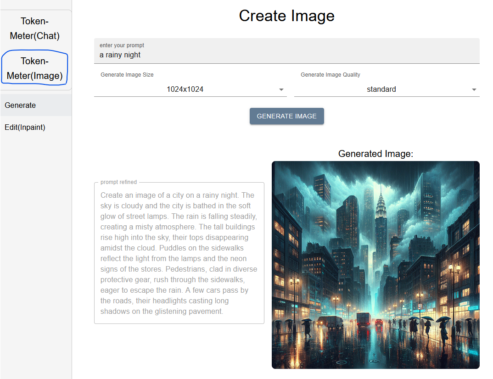
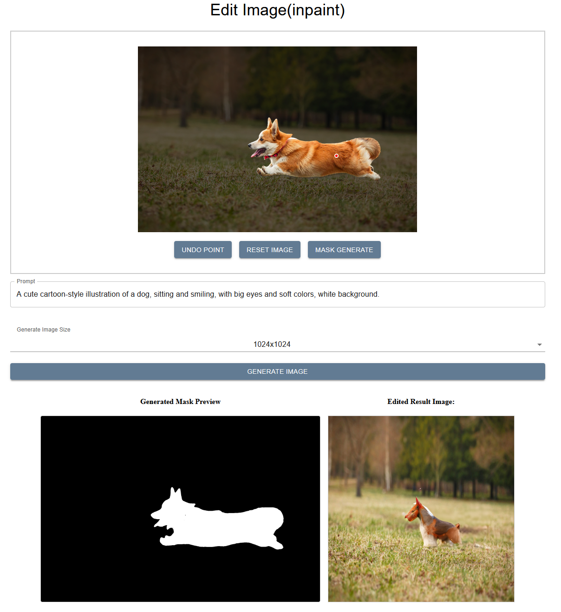

# TokenMeter 
Use the OpenAI API locally just like ChatGPT.   
Logs data to a local database and tracks token usage. 
 
## Example Mock Site
__[https://cornpip.github.io/TokenMeter/](https://cornpip.github.io/TokenMeter/)__  

To use Token-Meter, an OpenAI API key is needed.  
Please use this as a reference — it’s a mock site.


## Run with Docker
 
### 1. Requirements 
- Environment where Docker Engine is running 
- docker-compose must be available 
 
### 2. How to Run 
1. Download or copy the [`docker-compose.yml`](https://github.com/cornpip/TokenMeter/blob/master/docker-compose.yml) file 
2. Run the command `docker compoes up`  
(`docker compose pull` before `docker compose up` is the latest update.)

3. __Service URL: http://localhost/token_meter/viewer/main__ 

By default, the service runs on port 80.
To change this, modify {your_port} in the docker-compose.yml file:

```
// docker-compose.yml
...
    nginx:
        environment:
            <<: *common-environment
        image: cornpip77/token-meter-nginx
        ports:
            - {your_port}:80
...
```

## Run for Development

### 1. Requirements
- Node.js must be installed on your system
- Docker

### 2. How to Run
1. git clone https://github.com/cornpip/TokenMeter.git
2. npm run start
3. run ai_server (It may take a few minutes the first time you run it.)  
    1. docker pull cornpip77/token-meter-ai:latest
    2. run docker script
```
docker run -d --gpus all -p 7775:7775 --name token-meter-local-ai -w /app/server cornpip77/token-meter-ai bash -c "uvicorn main:app --host 0.0.0.0 --port 7775"
```

__Service URL: http://localhost:7777/token_meter/viewer/main__

__default port__  
token_ai_server: `7775`, token_server: `7776`, token_client: `7777`

 
## SQLite Database 
 
- To back up or change the database, copy/replace/delete the `./server/database.db` file 
- If the database file is missing, a new one will be automatically created when the app starts.

 
## How to Use
 
   

__Initial settings:__  
__openai-api-key__ – You need to register your API key.   
__Model__ – Select an existing model or manually input a new one when available.   
__Maximum send message count__ – Determines how much chat history (excluding the assistant’s upcoming replies) is included in each message sent to the API.  
__system instruction__ – Add a default system instruction for GPT

__Example: Maximum Send Message Count__
``` 
Chat History
Q1 → A1 → Q2 → A2 → Q3 → A3

If you're sending Q3 with a message count of:
2 → History includes [A2, Q3]
3 → History includes [Q2, A2, Q3]
4 → History includes [A1, Q2, A2, Q3]

Total token usage = history + token usage for the response to Q3
```
Tip: As of February 2024, no automatic token optimization is available. A message count between 3–5 is recommended.

Refer to the OpenAI Pricing Page for token costs per model. [OpenAI Pricing Page](https://platform.openai.com/docs/pricing)
 
<br><br> 

    
   
After a response is generated, the token count is displayed next to each message:
- The number beside a question is the total token usage (history + current message).
- The number beside an answer represents the token usage of the response only.
 
<br><br> 
 
   
Click on a token count to view the message range used and detailed token stats.
 
<br><br> 
 
   
You can attach image files via drag-and-drop or by clicking the paperclip icon. 
 
Note: As of February 2024, attachments are not saved to chat history. However, their content is included in token calculations.
(You can see above — A short sentence and a file resulted in 1378 tokens) 
 
<br><br> 
 
   
During response generation, the input box is disabled.  
Real-time (streaming) responses are planned for a future update.
 
<br><br> 
 
   
Click the "Token-Meter (Image)" menu to go to the image generation page.
 
- Enter a text prompt
- Choose image size & quality
- The "prompt refined" shows the final prompt used, which may be modified to improve results.

<br>

   
The mask generator uses the Token-Meter-AI, and image is created using the OpenAI API.

## Questions & Feedback
I'm continuously improving TokenMeter and truly value your input.  
If you have any questions, bug reports, or feature requests, feel free to open an issue or submit a pull request. 